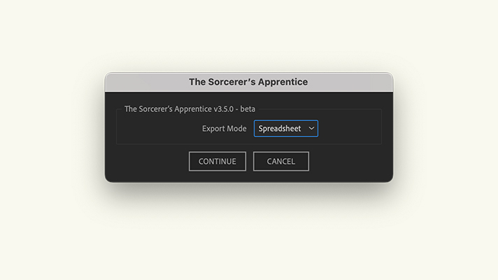
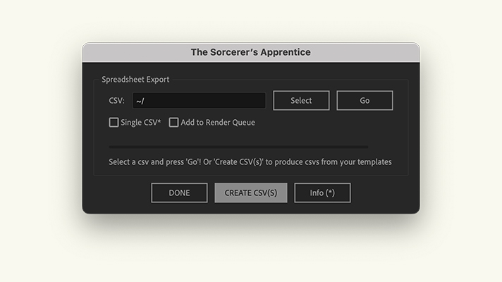

## Installation
Installed like any other AE script; download the both the script and the UI Panel from the downloads page, then add the unzipped script file to your AE Scripts folder (`Applications⁩/Adobe After Effects <version>⁩/Scripts` on a mac and `Program Files\Adobe\Adobe After Effects <version>\Support Files\Scripts` on a windows) and the unziped UI Panel file to the `ScriptUI Panels` subfolder.

Once both the script and the UI Panel are installed, restart AE (if it’s open) and open the `Sorcerer’s Apprentice.jsx` from the bottom of the ‘Window’ menu. You can then doc the panel wherever works for you and run the script from young Mickey’s magic button.

Starting with version 2.3.0, you are advised to also install the Google “dwebp” CLI app. You can do so by [Downloading it](https://github.com/Spectrio-Creative/sorcerers-apprentice/releases/latest) and placing it in the same folder as the main script file. In the event that the script cannot load an image file, it will try to convert it from a .webp to a .png*.

::: warning
_*This was a workaround that was added to the script because of After Effects’ limited support for .webp files. After Effects has since increased support for .webp files and this_ should _no longer be needed._
:::
::: tip
_Note: In order for the script to be able to troubleshoot unsupported .webp files (a common problem with MDS projects), you must give it permission to write files. You can do this my going to Preferences > Scripting & Expressions in After Effects and checking the “Allow Scripts to Write Files and Access Network” box._
:::

## Render Types

Since version 3.0.0 of the script, there has been two available methods for rendering compositions from templates: The _**traditional**_ menu-based method which renders a single composition at a time; and the _**spreadsheet**_ method which renders multiple compositions at a time based off of data from a given .csv file.

## Creating a Template CSV

 |  
:-------------------------:|:-------------------------:
Render mode selection.  | Create CSVs option.

::: details Example
Template |  Comp Title
:-------------------------:|:-------------------------:
Render mode selection.  | Create CSVs option.
:::