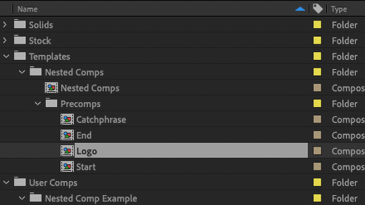

::: warning
Auto-linking of precomps is currently being implemented in the script. As such, much of this page is currently out of date and will be shortly updated.
:::

## Linking

Precomps can be helpful for organization but they can also be helpful for consolidating assets which get used multiple times in a project; a logo, for example.

As mentioned in the [Introduction tab](../#project-setup) , the script will automatically copy the template precomps to the new project folder if they are contained within a ‘Procomps’ subfolder they will not, however automatically relink in the new composition*. In order to tell the script that you want to use a precomp, you can title the layer the name of the precomp with double inward brackets. For instance, if my precomp was named ‘Logo’ I would title my layer `>> Intro <<`.

In the example below, the three highlighted precomps will be relinked in the project comp on layers 3, 4, and 5

*this is to avoid problems related to precomps that you might want to use across multiple templates.

  |   
:-------------------------:|:-------------------------:
Precomps to be relinked. | Location to relink.

## Nesting

Nesting precomps works exactly the same way as linking precomps in the main comp. Continuing with the Linking example, the ‘Logo’ precomp could be used in both the ‘Start’ and ‘End’ precomps.

  |   
:-------------------------:|:-------------------------:
Precomps to be relinked. | Location to relink.

## Visibility Tag

Group Subtag ‘v’ [`!Gv`]

Version 2.4 of the script includes a precomp visibility option. This could be useful if you want to have the option of swapping whole segments of your template. To implement, the 'v' subtag is used in conjuction with a [Group Layer](../#group-layer) of the same name as the precomp you want to toggle.

For instance, if I wanted to toggle my precomp titled ‘Intro’ (layer name `>> Intro <<`) I would include a Group Layer called `!Gv [Intro Tab] Intro` in my composition. This would add a ‘Visible’ toggle at the top of the ‘Intro Tab’ section of the UI which would allow me to turn on or off the visibility of the ‘Intro’ precomp.

::: tip
_Note: This only works for precomps in the main composition and does not currently work with the visibility of nested comps._
:::

## Dynamic Text Linking
If you want to consolidate reused text across multiple precomps (an address or company slogan, for example) you can do so with an expression on the Source Text property of child text layer with a reference to the parent. The default Source Text expression is something like `thisComp.layer("example layer").text.sourceText` and, in order to link layers across comps, you simply need to change thisComp to reference the name of the comp you want to use—i.e. `comp("address")`.

If the comp you are referencing is the main comp of the template, when the script is run, the expression will be updated to reference the main comp of the new project folder. If, however, the comp you are referencing is one of the template's precomps, then that precomp (and any others linked from expressions) will be renamed in the new project as `[Main Comp Name] Precomp Name`. After effects expressions do not support the use of Comp IDs, so this renaming is done to keep from the new project refferencing the template's precomp or vice versa.

As of version 2.4, you must tell the script that you have expressions that need relinking. This is done in a similar way to how precomps are linked, only with outward arrow brackets rather in inward ones (`<< !T Text Layer Name >>`).

In the example below, the precomps ‘Start’ and ‘End’ both have text layers that reference the source text of a layer in the precomp ‘Catchphrase’. The Source Text expression on both the layer in ‘Start’ and the layer in ‘End’ read `comp("Catchphrase").layer("!Tm [Company Setup] Intro Text").text.sourceText` and are named, respectively `<< !T Start Text >>` and `<< !T End Text >>`.

  |   
:-------------------------:|:-------------------------:
Project showing renamed precomp. | Original precomps and precomps with relinked / resized text.