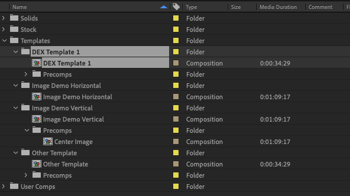
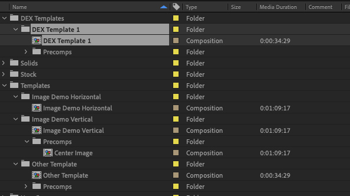
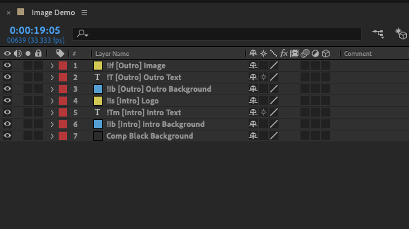
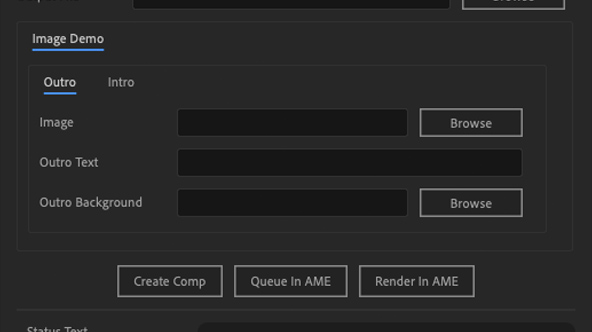
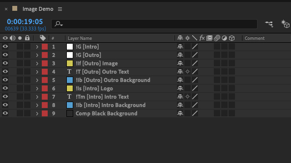
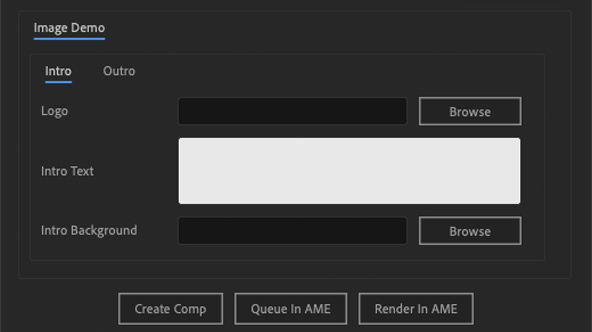
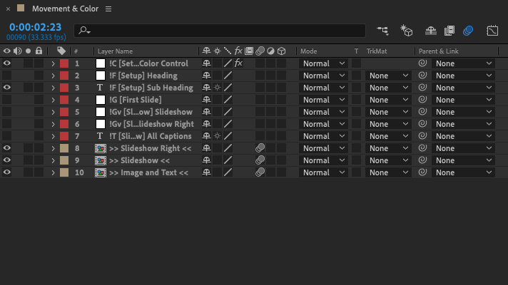
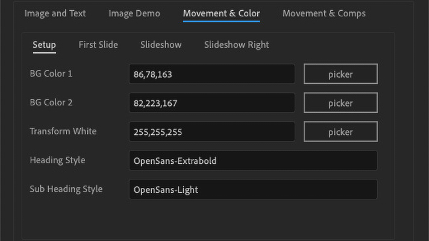

## Project Setup

To tell the script that you have templates to load, you have to organise your projects in a semi-specific way. The templates you would like it to load must be in a folder located at the root of your project which has a name that includes the word ‘Templates’. All of your templates do not have to be in the same folder but all template directories music include the word ‘Templates’.

The templates themselves also must be structured in a specific way. They must be a Composition inside a Directory of the same name. In the examples below, you’ll see the highlighted template is a Composition called ‘DEX Template 1’ inside of a Directory also called ‘DEX Template 1’. If your template includes precomps, they must be located inside a subfolder of thier template directory which includes the name ‘Precomps’. The name of the precomp folder can include other words as well but, unlike the main templates folder, you may not have more than one precomps folder within one template folder.

In both of the examples below, all four of the templates would be loaded into the script and checked for editable layers.

  |   
:-------------------------:|:-------------------------:
Example project with 4 templates in one templates folder. | Example project with 4 templates split between two folders.

## Composition Setup

Within your template composition, you must specify which layers you wish to be editable by the script. To do so, you must tag them with with an exclaimation point followed by the media type indicator. The media types and tags are as follows:

`!T`: for [Text Layers](../text-layer/)  
`!I`: for [Image Layers](../image-layer/)  
`!V`: for Video Layers (but shorthand for [Image Layers](../image-layer/))  
`!G`: for [Group Tag](#group-tag)  
`!C`: for [Color Control Layers](#color-control-layer)  
`!A`: for [Audio Layers](../audio-layer/)

After indicating which type of media the editable layer contains, the rest of the layer’s name determines where and how it will appear in the script menu. You can organise it into a menu tab with brackets and the rest of the layer name will be used as the name of the corresponding menu item. For example, a layer named `!Is [Intro] Logo` would first tell the script that the layer is an image which you would like to [scale down to fit](../text-layer/) and second that it should be editable in the menu by the field title ‘Logo’ organised under the tab ‘Intro’.

In the example below, the ‘Image Demo’ comp has seven layers, six of which are editable. They are broken up into two tabs—‘Outro’ and ‘Intro’—and tagged as Images and Text with a variety of subtags.

 |  
:-------------------------:|:-------------------------:
Example comp with 6 editable layers.  | Resulting menu when script is run on example comp.

::: tip
_Note: layers and tabs are added to the menu in the order in which they appear in the composition (with precomp layers and tabs added after all layers in the main composition). If you would like to further control the organisation of the menu tabs (for instance, putting the ‘Intro’ tab first instead of the ‘Outro’ tab in the below example), you should use the [Group Tag](#group-tag)._
:::

## Group Tag

Layer tag ‘G’ [`!G`]

In order to organise the template menu (for [traditional rendering]) in a way that makes sense to you, you can use the Group Tag on layers at the top of your project ordered the way you would like the menu tabs to be ordered. These layers are not processed as editable layers and will not, themselves, appear in the menu, so they may technically be any type of layer. For best organisation without compromising project performance, however, either an empty null object or empty adjustment layer is recommended.

The example below takes the project from the [Comp Setup](#composition-setup) section and adds two null objects tagged, respectively, as `!G [Intro]` and `!G [Outro]` which moves the ‘Intro’ tab before the ‘Outro’ tab. It’s worth mentioning that, in this example, the addition of the `!G [Outro]` layer did nothing to the appearance of the menu, but adds to the clarity & organisation of the template comp.

 |  
:-------------------------:|:-------------------------:
Example comp with group layers to organise menu.  | Resulting menu when script is run.

## Color Control Layer

Layer tag ‘C’ [`!C`]

You can control the colors of fonts and shapes in your template by setting up a color control layer then adding a fill effect with an expression to the layers you want to control.

First, to setup the color control layer, create a null layer & add one or more 'Color Control' effects to it. Especially if you are using more than one color control effect, it’s very helpful to then rename the layers to something memorable/helpful, like ‘Primary Color’.

With the color control layer setup, you can then link that to whichever layers you would like to use that color. On the layer which you want to follow the color rule, add a ‘Fill’ effect then `alt + click` on the stopwatch of the effect’s ‘Color’ attribute to add an expression. If your layer is in same comp as your color control layer, type `layer("Name of Your CC Layer").effect("Name of Your CC Effect")("Color")`, if your layer is in a precomp, then you must include a link to the main comp co`mp("Name of Your Template Comp").layer("Name of Your CC Layer").effect("Name of Your CC Effect")("Color")`.

::: tip
_Note: All layers linking to a Color Control layer in the main template comp will be automatically relinked when the script is run to the new project folder. However if the layer is instead linked to a Color Control layer inside a precomp, when the script is run, the new project will stil be linked to the CC layer in the template and will have to be manually relinked. Future versions of the script should address this issue._
:::

## Font Style Tag

Layer tag ‘F’ [`!F`]

Starting with version 2.6.0, the script supports font styling for creating more flexibile templates.

The name of the font style layer is used as the universal reference for that font style. So, for instance, if the layer’s name is `!F [Setup] Header` then any text layer tagged with `(Heading)` will be styled according to the style of this layer.

Note: the font style name can include spaces but should not include special characters or parentheses.

Like the `!G` layers, `!F` layers are not processed as editable layers so they may be any kind of layer. You’ll notice that in the example below one of the layers is a font layer and the other is a null object layer. The one difference between them is how the generated menu initially fills the font style field. For the null object (`!F [Setup] Heading`), the field is filled by the font of the first instance of a ‘Heading’ and for the font layer (`!F [Setup] Heading`) the field is filled by the font of that layer.

  |   
:-------------------------:|:-------------------------:
Example comp with 2 font style layers. | Resulting menu when script is run.

::: tip
_More on the usage of font style in the [Using Font Styles](text-layer/#using-font-styles) section._
:::