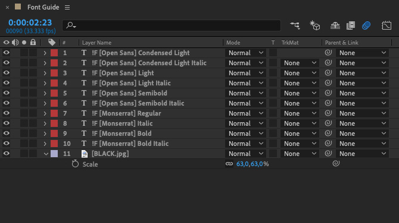
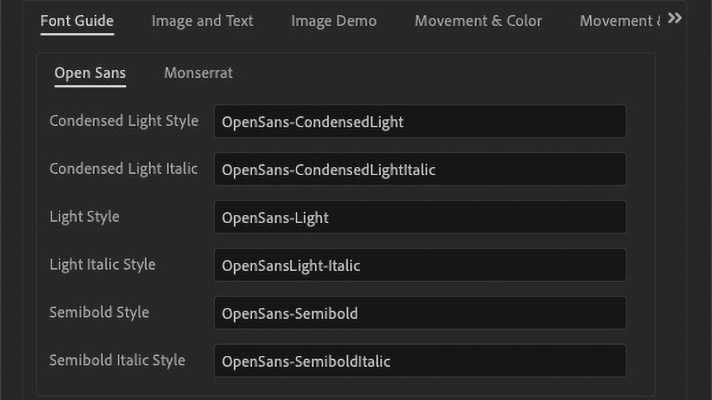

## Single Line Text

By default, if the bounds of the text box is shorter than two lines long (as defined by the leading), text is handled as a single line. When single-line text exceeds the bounds of the text-box, it is resized with an AE Expression on the `scale` property of the text layer and remains a single line (even if the new text is extremely long).

  |   
:-------------------------:|:-------------------------:
Single-line text placeholder in template comp. | Example project with 4 templates split between two folders.

::: tip
_Tip: You can use the layer's anchor point to determine how the text will be aligned after resize. In the example above, the anchor point is at the bottom of the textbox so that the distance between the text and the image remains the same even while the new text is significantly smaller in the `y` direction._
:::

## Multiline Text

By default, if the bounds of the text box is two lines long (as defined by the leading) or greater, text is handled as multiline. When multiline text exceeds the bounds of the text-box, it is resized by decreasing the font size until the text fits into the text box.

  |   
:-------------------------:|:-------------------------:
Multiline text placeholder in template comp. | Example project with long text scaled down to fit in text box.

::: tip
_Note: a textbox that includes only one line of text but extends in the `y` direction greater than an additional line, is considered as multiline text by the script._
:::

## Visibility Tag

Text Subtag ‘v’ [`!Tv`]

In traditional render mode, the visibility tag adds a checkbox to the menu field in the script which allows you to turn the layer on and off from the script. This is especially useful for adding options into your templates. For example, you might have a logo zone that you might want to replace with text if the client doesn’t have a logo.

The visibility tag can also be utilized in spreadsheet render mode. If a text field includes the `v` tag, the text can be turned on or off by prepending brackets that surround an "x" (`[x]`) or a space (`[ ]`) to the spreadsheet field.

::: tip
_Note: text will be replaced even if a field is turned off. For example, `[ ] Oh the summertime is coming, and the trees are sweetly blooming` will replace the original text with the new text ("Oh the summertime…") but will disable the visibility of the text layer. This can be useful if you are using expressions to reference the same text in multiple places but want to maintain that text with a non-visble layer._
:::

## Using Font Styles

A font style can be attached to a layer with a parenthetical reference immediately following the main tag, such as `!Fm(P1) [First Slide] Body Text`. It’s important to note that the font style only controls the typeface being used. The size is controlled by the size of the [text box](#point-text) and the color can be controlled by setting up a [Color Control layer](../#color-control-layer).

In the example below the font style is setup in the main comp with the layer labeled `!F [Setup] Heading` then attached to the text layer by labeling it `!T(Heading) [First Slide] Heading`. Upon replacing the style OpenSans-Extrabold with OpenSansLight-Italic and running the script, all layers with the attached, ‘Header’, style (in this case just the one) are changed to Open Sans Light Italic.

  |   
:-------------------------:|:-------------------------:
Template comp with Heading style. | Resulting comp when script is run.

::: warning
Tip: Because of the fact that After Effects doesn’t make a list of available fonts readily available, the font name must be typed in exactly and, given that After Effects does not use the names of the font files as references, it can be difficult to predict what the exact name of a font should be. Because of this, it's recommended that you make a [Font Reference](#making-a-font-reference) template.
:::

## Making a Font Reference

Unfortunately, After Effects doesn’t reference fonts by very predictable names. For instance, Open Sans Light Italic, you may have noticed in the [Using Font Styles](#using-font-styles) section about is referenced as ‘OpenSansLight-Italic’ even though it’s pulling from the file ‘OpenSans-LightItalic.ttf’. You might then think that Open Sans Light would be, then, called by ‘OpenSansLight’ but AE proves inconsistent here again by, in this case, going along with the filename ‘OpenSans-Light’.

Making one is quite simple. First, [create a blank template](../#project-setup), then simply create a font layer for each font you’d like to be able to easily reference and name them as `!F [Font Family] Font Style`. The below example shows a template with select styles from Open Sans and Montserrat.

  |   
:-------------------------:|:-------------------------:
Template comp with font layers. | Resulting menu when script is run.

## Point Text

::: danger WARNING
The script was developed in such a way that it used the bounds of a text box to set the potential area of the new text. Because of this, for any text you wish to make editable in the template, it is strongly recommended that you use Area Text instead of Point Text (ie: when creating a text field, click & drag out a box instead of simply clicking and then typing). If you use Point text, the text will still be editable but it will not resize and could possible cause other issues.
:::