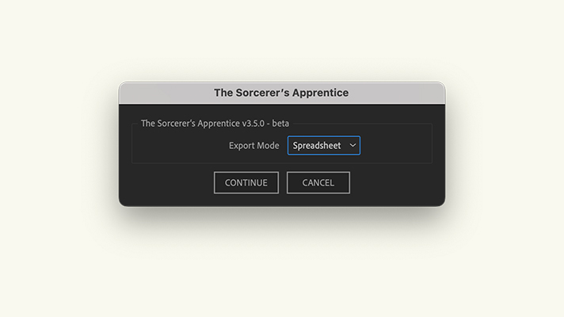
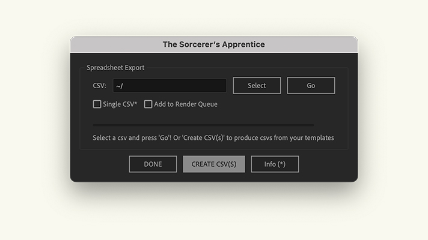

## Installation
Installed like any other AE script; download the both the script and the UI Panel from the downloads page, then add the unzipped script file to your AE Scripts folder (`Applications⁩/Adobe After Effects <version>⁩/Scripts` on a mac and `Program Files\Adobe\Adobe After Effects <version>\Support Files\Scripts` on a windows) and the unziped UI Panel file to the `ScriptUI Panels` subfolder.

Once both the script and the UI Panel are installed, restart AE (if it’s open) and open the `Sorcerer’s Apprentice.jsx` from the bottom of the ‘Window’ menu. You can then doc the panel wherever works for you and run the script from young Mickey’s magic button.

::: warning
_Starting with version 2.3.0, if you are running an older version of After Effects, it is recommended that you also install the Google “dwebp” CLI app. You can do so by [Downloading it](https://github.com/Spectrio-Creative/sorcerers-apprentice/releases/latest) and placing it in the same folder as the main script file. In the event that the script cannot load an image file, it will try to convert it from a .webp to a .png._
:::
::: warning
_Note: If you are running an older version of After Effects, in order for the script to be able to troubleshoot the unsupported .webp files, you must give the script permission to write files. You can do this my going to Preferences > Scripting & Expressions in After Effects and checking the “Allow Scripts to Write Files and Access Network” box._
:::

## Render Types

Since version 3.0.0 of the script, there has been two available methods for rendering compositions from templates: The _**traditional**_ menu-based method which renders a single composition at a time; and the _**spreadsheet**_ method which renders multiple compositions at a time based off of data from a given .csv file.

## Creating a Template CSV

In order to render templates with the _**spreadsheet**_ mode, it’s important to have a .csv file that’s properly formatted itself. The easiest way to insure that the spreadsheet is properly formatted is to work off of spreadsheets exported from the script.

To export spreadsheets, first open the _AE_ file that contains the project template you wish to work with, then run the script, choose the "spreadsheet" export mode, then select "CREATE CSV(S)". You will then be able to select the folder you wish to export them to and it will create spreadsheets from all the templates present within the open project.

 |  
:-------------------------:|:-------------------------:
Render mode selection.  | Create CSVs option.

::: details Example CSV
Template |  Comp Title | Output File | [companyInfo] Address | [companyInfo] Logo | [color] Primary Color
:-------------------------:|:-------------------------:|:-------------------------:|:-------------------------:|:-------------------------:|:-------------------------:
Color Logo Template  | Comp Render 1 | ~/comprender1.mp4 | 123 Street Address \| City, State, Zip | logo.png | #0000ff
Color Logo Template  | Comp Render 2 | ~/comprender2.mp4 | 456 Street Address | logo2.png | 0,0,255

This example would render two comps of the names "Comp Render 1" and "Comp Render 2" both based on the "Color Logo Template".
:::