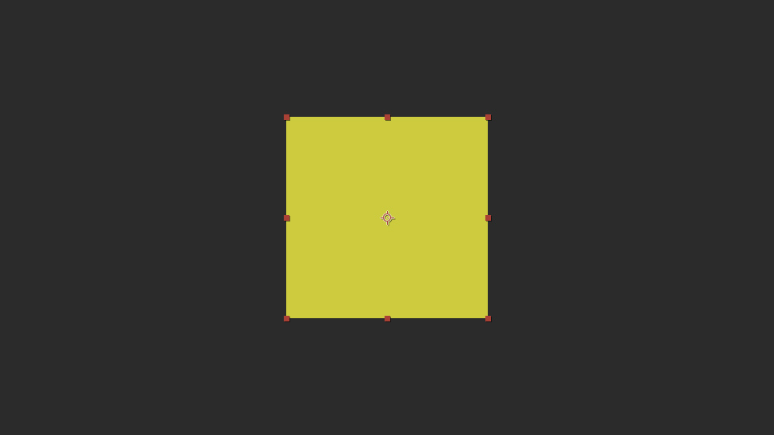
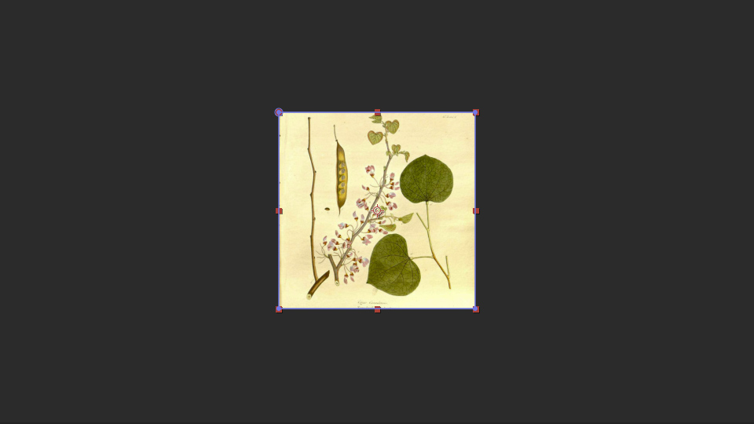
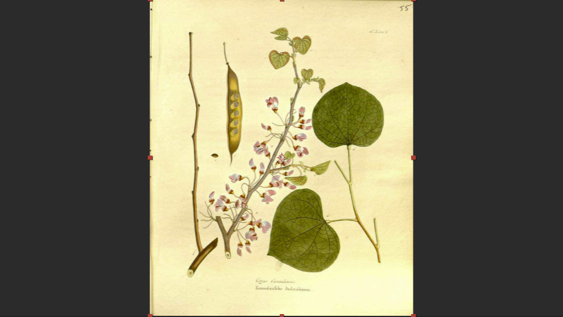
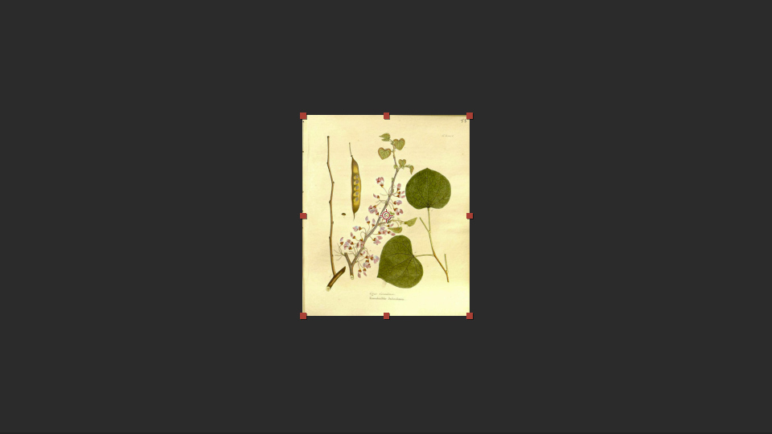

## Visibility Tag

Image Subtag ‘v’ [`!Iv`]

The visibility tag adds a checkbox to the menu field in the script which allows you to turn the layer on and off from the script. This is especially useful for adding options into your templates. For example, you might have a logo zone that you might want to replace with text if the client doesn’t have a logo.

## Default Image Sizing

## Background Sizing Property

Image Subtag 'b' [`!Ib`]

The Background Sizing Property tells the script that you want to fill the placeholder space with the image you've chosen as a replacement. This works similarly to the css `background-size` property `cover`. It is intended for background images (hence the name) and therefore overflow is visible. If you wish to crop the image, use the [Fill Sizing Property](#fill-sizing-property).

In the example below, the placeholder [`1920, 1080px`] is proportionally wider than the image [`898px, 1080px`], so the image is scaled up to be the same width as the placeholder [`1920px`].

  |   
:-------------------------:|:-------------------------:
Image placeholder in template comp. | Resulting image, scaled to fill the bg, in final comp.

## Fill Sizing Property

Image Subtag 'f' [`!If`]

The Fill Sizing Property works exactly like the [Background Sizing Property](#background-sizing-property) except that, after scaling the image to fit the placeholder, it then uses a mask to crop the image to shape of the placeholder.

In the example below, the placeholder [`500px, 500px`] is proportionally wider than the image [`898px, 1080px`], so the image is scaled down to be the same width as the placeholder [`500px`] then cropped to also be the same height as the placeholder [`500px`].

  |   
:-------------------------:|:-------------------------:
Image placeholder in template comp. | Resulting image, masked and cropped, in final comp.

## No Scale Sizing Property

Image Subtag 'n' [`!In`]

The No Scale Sizing Property is for when you have an image that you do not want to scale at all. The image is simply centered on center of the placeholder and pulled in at its original size.

In the example below, the placeholder is centered on the template comp, so the image is centered on the final comp at its original size [`898px, 1080px`].

  |   
:-------------------------:|:-------------------------:
Image placeholder in template comp. | Resulting image, centered, in final comp.

::: tip
_Note: in future, I plan to set it to align the image based on the anchor point (such that you could align the image top-left by placing the achor point at the top, left of the placeholder). So to future proof your templates using the current script, insure that your anchor points are set to the center of your placeholder comps_
:::

## Scale Down Sizing Property

Image Subtag 's' [`!Is`]

The Scale Down Sizing Property—best used for logo zones, etc—is used for setting a maximum image size. If the image is smaller than the placeholder, it acts like the [No Scale Sizing Property](#no-scale-sizing-property) and, if the image is larger than the placeholder, it falls back to the [Default Sizing](#default-image-sizing).

In the example below, the placeholder [500px, 500px] is centered on the template comp and is larger than the image [333px, 400px], so the image is centered on the final comp at its original size.

  |   
:-------------------------:|:-------------------------:
Image placeholder in template comp. | Resulting image, centered and scaled, in final comp.

::: tip
_Note: in future, I plan to set it to align the image based on the anchor point (such that you could align the image top-left by placing the achor point at the top, left of the placeholder). So to future proof your templates using the current script, insure that your anchor points are set to the center of your placeholder comps_
:::